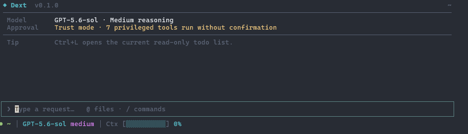

# Dext

<p align="center">
  
</p>

<p align="center">
  <strong>A source-first coding agent that lives in your terminal.</strong><br>
  One Rust binary. Native tools. Project-scoped sessions. Guardrails you can inspect.
</p>

<p align="center">
  <a href="https://siliconstate.github.io/Dext/">Documentation</a> ·
  <a href="docs/USAGE.md">Usage</a> ·
  <a href="docs/PACKS.md">Packs</a> ·
  <a href="SECURITY.md">Security</a>
</p>

<p align="center">
  <br>
  <sub>Inline TUI with native scrollback. Trust mode is explicitly enabled in this capture; Dext defaults to Ask.</sub>
</p>

Dext is an interactive terminal agent and automation-friendly CLI. It supports ChatGPT/Codex, OpenAI, Anthropic, GLM, Kimi Code, DeepSeek, and local OpenAI-compatible models without requiring a Dext-hosted service.

## Install

Linux and macOS:

```bash
curl --proto '=https' --tlsv1.2 -LsSf https://raw.githubusercontent.com/SiliconState/Dext/main/scripts/install.sh | sh
```

Windows PowerShell:

```powershell
irm https://raw.githubusercontent.com/SiliconState/Dext/main/scripts/install.ps1 | iex
```

The installers select the matching release archive, require an exact `vX.Y.Z` tag, verify its SHA-256 checksum, and validate that it starts and reports the selected version before replacement. Dext has not published its first tagged release yet, so the current installers resolve and pin the current `main` commit before running a locked Cargo build; that fallback requires [Rust](https://rustup.rs). Set `DEXT_SOURCE_FALLBACK=0` to require a release instead. Set `DEXT_REQUIRE_ATTESTATION=1` to additionally require [GitHub CLI](https://cli.github.com/) verification of release provenance; because source builds have no release attestation, that setting also disables source fallback.

Prefer to review before running? Download [`install.sh`](scripts/install.sh) or [`install.ps1`](scripts/install.ps1), inspect it, then execute it locally. Release provenance and manual verification are documented in [`docs/RELEASING.md`](docs/RELEASING.md).

<details>
<summary>Install from a checkout</summary>

```bash
git clone https://github.com/SiliconState/Dext.git
cd Dext
cargo install --path . --force --locked
```

</details>

> Windows tool calls need a real `bash.exe`, such as [Git for Windows](https://gitforwindows.org/). Dext ignores the WSL app alias; set `DEXT_BASH_PATH` to override discovery.

## Start

```bash
# Browser login for ChatGPT/Codex
dext auth login chatgpt

# Open the provider login page, then paste the key at Dext's prompt
# (do not put secrets in shell command arguments)
dext auth login anthropic

# Work interactively in the current project
dext
```

One-shot and local-model use are just as direct:

```bash
dext "review this repository and find the riskiest bug"
dext auth provider local
dext --frugal --effort off
```

See [`docs/USAGE.md`](docs/USAGE.md) for provider setup, model routing, sessions, Seats, automation, and the CLI reference.

## Why Dext

- **Terminal-native.** Inline Ratatui UI with normal scrollback, streaming input, one-shot output, JSON, and stream-JSON.
- **Source-first.** Prompts, provider adapters, policies, state, tools, and UI are auditable in this repository.
- **Recoverable.** Git-native pre-mutation checkpoints, previews, side-effect journals, and explicit undo.
- **Bounded by default.** Approval profiles, filesystem sandboxing, credential scrubbing, privacy redaction, and capped I/O.
- **Provider-neutral.** Cloud and local providers share one compact native tool layer.
- **Extensible without core bloat.** User-owned [packs and shelves](docs/PACKS.md) can add workflows and reviewed runtime tools.
- **Explicit continuity.** By default, Dext autosaves session state under a project-specific key; `dext --resume` restores the latest session. Optional `recall.md` and [Seat](docs/USAGE.md#seats) summaries are user-authored context, not autonomous memory.

## A small working surface

```text
dext                         interactive session
dext "fix the failing test"  one-shot task
dext --resume                resume this project's latest session
dext doctor                  inspect the active safety and state posture
dext undo --list             inspect recovery checkpoints
dext pack run NAME TASK      run a user-owned workflow pack
```

Inside Dext, type `/help` for commands and `?` on an empty prompt for the keymap.

## Safety, plainly

Dext asks before privileged tools by default. `workspace-write` confines writes to the project, scratch space, and selected toolchain caches on supported Linux/macOS hosts; Windows and unsupported hosts retain native guards but do not have equivalent kernel filesystem confinement. Outbound network access from approved subprocesses is not sandboxed.

Git checkpoints are recovery aids, not a substitute for commits. Credentials are scrubbed from agent-run subprocesses unless you explicitly opt in. Run `dext doctor` to inspect the current posture, and read [`SECURITY.md`](SECURITY.md) plus the [risk register](docs/RISK_REGISTER.md) for exact boundaries.

## Documentation

- [Usage and configuration](docs/USAGE.md)
- [Packs and shelves](docs/PACKS.md)
- [Technical architecture](docs/ARCHITECTURE.md)
- [TUI behavior](docs/TUI.md)
- [Release verification](docs/RELEASING.md)
- [Contributing](CONTRIBUTING.md)
- [Canonical technical documentation](https://siliconstate.github.io/Dext/)

## Development

Dext requires stable Rust with edition 2024 support. The build, test, release, and reinstall workflow lives in [`CONTRIBUTING.md`](CONTRIBUTING.md); release-owner checks live in [`docs/RELEASING.md`](docs/RELEASING.md).

## License

[MIT](LICENSE)
